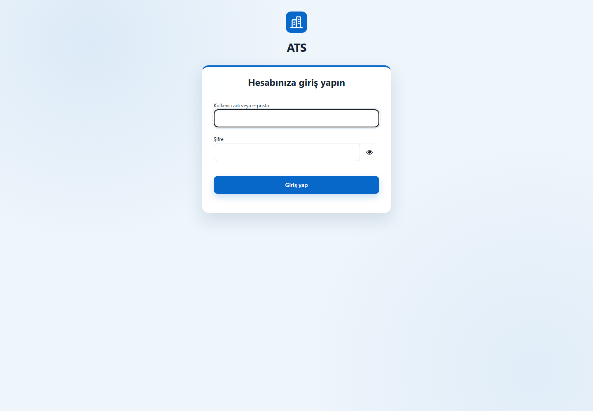
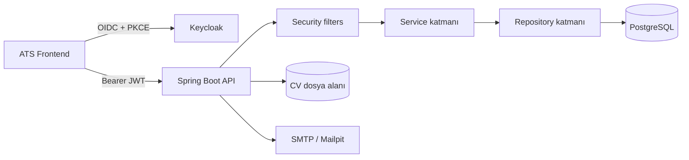

# ATS Backend

ATS Backend; çok şirketli aday takip ve işe alım süreçlerini yöneten, Spring Boot tabanlı REST API uygulamasıdır. Adaylar, ilk temas kayıtları, pozisyonlar, departmanlar, işe alım akışları, görüşmeler ve değerlendirmeler tek bir veri modeli üzerinde yönetilir. Kimlik doğrulama Keycloak ile, yetkilendirme ise rol, izin, şirket ve departman kapsamı birlikte değerlendirilerek uygulanır.

> Frontend deposu: [elifnurbeycan/ats-system-frontend](https://github.com/elifnurbeycan/ats-system-frontend)

## Keycloak giriş teması



Uygulamanın kontrol paneli, adaylar, iletişim, pozisyonlar ve rol yönetimi ekranlarından oluşan; kişisel alanları maskelenmiş görsel galeri frontend deposunun [README dosyasında](https://github.com/elifnurbeycan/ats-system-frontend#uygulama-ekranları) bulunur.

## Öne çıkan özellikler

- Çok şirketli (multi-tenant) veri modeli
- Şirket ve departman bazlı veri izolasyonu
- Keycloak OIDC/JWT kimlik doğrulaması
- Rol ve ayrıntılı izin tabanlı yetkilendirme
- Aday, özgeçmiş, not, etkileşim ve takip yönetimi
- İlk temas havuzu ve aday sürecine aktarım
- Pozisyon, departman ve departman yöneticisi yönetimi
- Özelleştirilebilir işe alım akışları ve aşama geçmişi
- Görüşme, değerlendirme ve ücret bilgisi yönetimi
- Kontrol paneli metrikleri ve raporlama endpoint'leri
- Değiştirilemez denetim kayıtları
- Flyway ile sürümlü veritabanı migrasyonları
- ATS arayüzüyle uyumlu özel Keycloak giriş teması

## Teknoloji yığını

| Alan                      | Teknoloji                                         |
| ------------------------- | ------------------------------------------------- |
| Dil                       | Java 21                                           |
| Uygulama çatısı           | Spring Boot 3.5.16                                |
| Güvenlik                  | Spring Security, OAuth2 Resource Server, Keycloak |
| Veri erişimi              | Spring Data JPA, Hibernate                        |
| Veritabanı                | PostgreSQL 17                                     |
| Migrasyon                 | Flyway                                            |
| Nesne eşleme              | MapStruct                                         |
| E-posta geliştirme ortamı | Mailpit                                           |
| Test                      | JUnit 5, Spring Boot Test, MockMvc, H2            |
| Derleme                   | Maven Wrapper                                     |

## Mimari



Katmanlı paket yapısı her iş alanını controller, service, repository, entity ve DTO bileşenleriyle ayırır:

```text
src/main/java/com/yasarbilgi/ats/
├── auth, security, permission, role, user
├── company, department, position
├── candidate, candidatenote, candidateprocess
├── contactlead, interaction, interview, followup
├── pipeline, dashboard, audit, attachment
└── common, notification
```

## Güvenlik modeli

İstek güvenliği yalnızca frontend görünürlüğüne bırakılmaz. Backend her istekte aşağıdaki kapsamları doğrular:

1. Keycloak tarafından imzalanan JWT'nin issuer ve gerekirse audience bilgisi doğrulanır.
2. `TenantIsolationFilter`, URL'deki `companyId` ile oturum sahibinin şirketini eşleştirir.
3. `DepartmentDataScopeFilter`, departman kapsamlı kullanıcıların başka departmanlara erişmesini engeller.
4. `DataScopeService`, servis ve sorgu katmanında erişilebilir departmanları merkezi olarak hesaplar.
5. Endpoint ve işlemler rol/izin kurallarıyla korunur.

Ek güvenlik önlemleri:

- Yerel parola hash'leri V25 migrasyonuyla kaldırılmıştır; kullanıcı parolaları Keycloak'ta tutulur.
- Platform yöneticisi ve şirket kullanıcısı alanları birbirinden ayrıdır.
- CORS origin listesi ortam değişkeniyle sınırlandırılır.
- Kimlik doğrulama ve erişim hataları ortak JSON biçiminde döndürülür.
- Hassas alanlar denetim kaydına yazılmadan önce temizlenir.
- CV yüklemeleri 6 MB ile sınırlandırılır ve yapılandırılabilir bir klasörde saklanır.
- Gerçek `.env` ve `application-dev.yaml` dosyaları Git'e dahil edilmez.

## Gereksinimler

- JDK 21
- Docker Desktop ve Docker Compose
- Git

Maven'ın ayrıca kurulması gerekmez; depodaki Maven Wrapper kullanılabilir.

## Hızlı başlangıç

### 1. Depoyu klonlayın

```powershell
git clone https://github.com/elifnurbeycan/ats-system.git
cd ats-system
```

### 2. Docker ortamını hazırlayın

```powershell
Copy-Item .env.example .env
```

`.env` içindeki `change-me` değerlerini güçlü ve benzersiz parolalarla değiştirin. Ardından altyapı servislerini başlatın:

```powershell
docker compose up -d
docker compose ps
```

| Servis       | Yerel adres/port                               | Amaç                      |
| ------------ | ---------------------------------------------- | ------------------------- |
| PostgreSQL   | `localhost:55432`                              | ATS veritabanı            |
| Keycloak     | [http://localhost:8081](http://localhost:8081) | Kimlik ve erişim yönetimi |
| Mailpit SMTP | `localhost:1025`                               | Geliştirme e-postaları    |
| Mailpit UI   | [http://localhost:8025](http://localhost:8025) | E-posta önizleme          |

### 3. Uygulama profilini oluşturun

```powershell
Copy-Item `
  src/main/resources/application-dev.example.yaml `
  src/main/resources/application-dev.yaml
```

Docker Compose kullanıyorsanız `application-dev.yaml` içindeki datasource değerlerini aşağıdaki şekilde güncelleyin:

```yaml
spring:
  datasource:
    url: jdbc:postgresql://localhost:55432/ats_system
    username: postgres
    password: .env-dosyasindaki-POSTGRES_PASSWORD
```

`application-dev.yaml` yalnızca yerel kullanım içindir ve commit edilmemelidir.

### 4. Keycloak'u yapılandırın

Yeni bir Docker volume ile ilk kez başlatıyorsanız Keycloak yönetim panelinde aşağıdaki temel yapılandırmayı oluşturun:

- Realm: `ats`
- Public frontend client: `ats-frontend`
- Standard Flow / Authorization Code: açık
- PKCE: `S256`
- Valid redirect URI: `http://localhost:3000/*`
- Web origin: `http://localhost:3000`
- Realm rolleri: ihtiyaca göre `SUPER_ADMIN`, `COMPANY_ADMIN`, `HR`, `RECRUITER`, `GENERAL_MANAGER`, `DEPARTMENT_MANAGER`, `HIRING_MANAGER`, `INTERVIEWER`

Özel giriş görünümü için realm login theme değerini `ats-login` seçin. Tema dosyaları `keycloak/themes/ats-login` altında tutulur ve Compose tarafından read-only bağlanır.

Backend üzerinden Keycloak kullanıcı yönetimi gerekmiyorsa Admin API entegrasyonunu kapalı bırakın:

```dotenv
KEYCLOAK_ADMIN_API_ENABLED=false
```

Etkinleştirilecekse yalnızca backend'e ait confidential client kullanın; client secret hiçbir zaman frontend'e veya Git'e yazılmamalıdır.

### 5. Backend'i çalıştırın

```powershell
.\mvnw.cmd spring-boot:run "-Dspring-boot.run.profiles=dev"
```

API [http://localhost:8080](http://localhost:8080), sağlık kontrolü ise [http://localhost:8080/actuator/health](http://localhost:8080/actuator/health) adresinde yayınlanır.

## Yapılandırma

Başlıca ortam değişkenleri:

| Değişken                      | Açıklama                           | Yerel örnek                                    |
| ----------------------------- | ---------------------------------- | ---------------------------------------------- |
| `SPRING_DATASOURCE_URL`       | PostgreSQL JDBC adresi             | `jdbc:postgresql://localhost:55432/ats_system` |
| `SPRING_DATASOURCE_USERNAME`  | Veritabanı kullanıcısı             | `postgres`                                     |
| `SPRING_DATASOURCE_PASSWORD`  | Veritabanı parolası                | gizli değer                                    |
| `KEYCLOAK_ISSUER`             | Kabul edilen JWT issuer            | `http://localhost:8081/realms/ats`             |
| `KEYCLOAK_AUDIENCE`           | Beklenen API audience              | yerelde isteğe bağlı                           |
| `KEYCLOAK_REQUIRED`           | Keycloak zorunluluğu               | `true`                                         |
| `CORS_ALLOWED_ORIGINS`        | İzin verilen frontend origin'leri  | `http://localhost:3000`                        |
| `ATS_CV_STORAGE_PATH`         | CV dosyalarının saklandığı dizin   | `./data/uploads/cv`                            |
| `MAIL_HOST`, `MAIL_PORT`      | SMTP bağlantısı                    | `localhost`, `1025`                            |
| `MANAGER_REVIEW_MAIL_ENABLED` | Yönetici değerlendirme e-postaları | `false`                                        |
| `FRONTEND_BASE_URL`           | E-postalardaki frontend tabanı     | `http://localhost:3000`                        |

Üretimde tüm sırlar ortam değişkeni veya bir secret manager üzerinden verilmelidir.

## API grupları

Tüm tenant endpoint'leri şirket kimliğini URL içinde taşır: `/api/v1/companies/{companyId}/...`

| Endpoint grubu                                   | Amaç                                       |
| ------------------------------------------------ | ------------------------------------------ |
| `/api/v1/auth`                                   | Oturum kullanıcısı ve eşleştirme bilgileri |
| `/api/v1/auth/platform`                          | Platform yöneticisi oturum bilgileri       |
| `/api/v1/platform/companies`                     | Platform düzeyinde şirket yönetimi         |
| `/departments`, `/positions`, `/users`, `/roles` | Organizasyon ve erişim yönetimi            |
| `/candidates`, `/candidates/{id}/cv`             | Aday ve özgeçmiş yönetimi                  |
| `/candidates/{id}/notes`                         | Aday notları ve aşama değerlendirmeleri    |
| `/contact-leads`                                 | İlk temas havuzu                           |
| `/pipelines`, `/candidate-processes`             | İşe alım akışları ve süreçler              |
| `/interviews`, `/interactions`, `/follow-ups`    | Görüşme ve iletişim kayıtları              |
| `/dashboard`                                     | Kontrol paneli metrikleri                  |
| `/audit-logs`                                    | Denetim kayıtları                          |

## Veritabanı migrasyonları

Flyway migrasyonları `src/main/resources/db/migration` altında bulunur ve uygulama açılışında otomatik doğrulanıp uygulanır. Şema değişikliği yaparken mevcut migration dosyalarını değiştirmek yerine yeni, sıralı bir migration ekleyin.

```text
V1__create_core_schema.sql
...
V26__add_candidate_note_pipeline_stage.sql
```

## Testler

```powershell
.\mvnw.cmd test
```

Test paketi; uygulama bağlamı, JWT rol dönüşümü, tenant izolasyonu, departman veri kapsamı ve rol yönetimi entegrasyonlarını kapsar. Testler H2 bellek içi veritabanıyla çalışır; yerel PostgreSQL verisini değiştirmez.

## Production kontrol listesi

- `KEYCLOAK_REQUIRED=true` kullanın.
- `KEYCLOAK_ISSUER` ve `KEYCLOAK_AUDIENCE` değerlerini production adresleriyle sınırlandırın.
- Yalnızca gerçek frontend origin'lerini `CORS_ALLOWED_ORIGINS` içine alın.
- Docker örnek parolalarını değiştirin ve repoya göndermeyin.
- Keycloak Admin API gerekiyorsa en az yetkili confidential client kullanın.
- TLS'yi reverse proxy veya platform katmanında zorunlu tutun.
- CV saklama alanını yedekleyin ve dosya sistemi izinlerini sınırlandırın.
- Actuator endpoint'lerini dış ağa doğrudan açmayın.
- Veritabanı ve Keycloak volume'ları için düzenli yedek alın.

## Commit standardı

Proje Conventional Commits biçimini kullanır:

```text
feat: yeni özellik
fix: hata düzeltmesi
refactor: davranışı değiştirmeyen yeniden düzenleme
test: test ekleme veya güncelleme
docs: dokümantasyon değişikliği
build: derleme ya da bağımlılık değişikliği
chore: bakım çalışması
```

## Proje durumu

Proje aktif olarak geliştirilmektedir.
